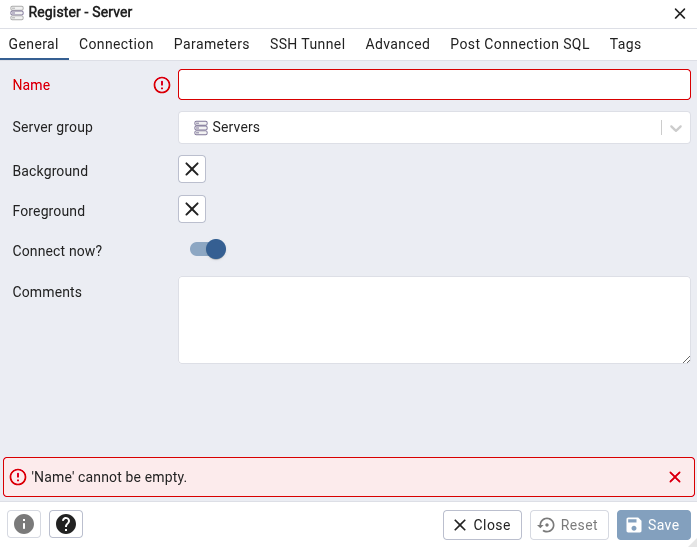
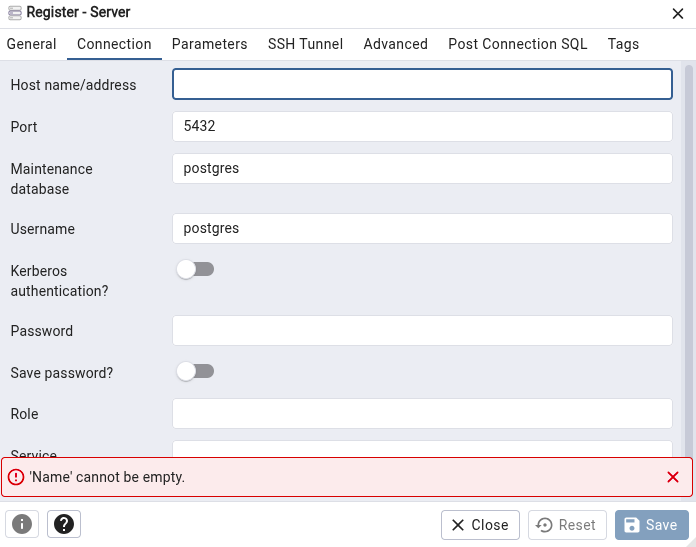
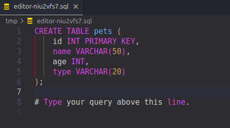
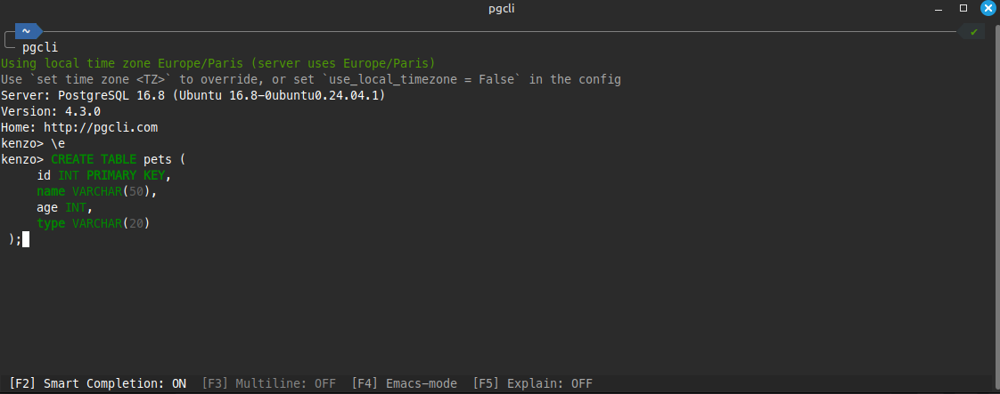

# **PostgreSQL**

## 📥 Installation

### 🐧 **Linux**

```bash
sudo apt install postgresql postgresql-contrib
```

```bash
sudo -i -u postgres
psql
```

### 🪟 **Windows**

[Lien de téléchargement PostgreSQL](https://www.postgresql.org/download/windows/)

## 🔧 Configuration

Se connecter a l'utilisateur de base **postgres** :

```bash
sudo -u postgres psql
```

Créer un utilisateur :

```SQL
CREATE USER votre_utilisateur WITH PASSWORD 'votre_mot_de_passe';
```

Se connecter a une base de données avec un utilisateur :

```SQL
psql -u utilisateur -d base-de-données
```

Donner toutes les permissions à un utilisateur dans une base de données :

```SQL
GRANT ALL PRIVILEGES ON DATABASE votre_base_de_donnees TO votre_utilisateur;
```

```SQL
REVOKE ALL PRIVILEGES ON DATABASE base_de_données FROM nom_utilisateur;
```

**Les permissions :**

- ALL PRIVILEGES
- SELECT
- INSERT
- UPDATE
- DELETE

## 🐘 **Commandes PSQL**

| Commande        | Description                                |
| --------------- | ------------------------------------------ |
| `\l` ou `\list` | Liste les bases de données                 |
| `\c nom_base`   | Se connecter à une base                    |
| `\conninfo`     | Informations de connexion actuelles        |
| `\dt`           | Liste les tables                           |
| `\dt+`          | Liste les tables avec détails              |
| `\dv`           | Liste les vues                             |
| `\d nom_table`  | Description d’une table                    |
| `\d+ nom_table` | Détails étendus sur une table              |
| `\di`           | Liste les index                            |
| `\ds`           | Liste les séquences                        |
| `\df`           | Liste les fonctions                        |
| `\dn`           | Liste les schémas                          |
| `\du`           | Liste les rôles utilisateurs               |
| `\dx`           | Liste les extensions installées            |
| `\d`            | Liste tous les objets dans le schéma actif |
| `\d nom_objet`  | Description d’un objet                     |

## 🏷️ **Types de données PostgreSQL**

| **Catégorie**                        | **Type**                | **Description**                                                                                                                |
| ------------------------------------ | ----------------------- | ------------------------------------------------------------------------------------------------------------------------------ |
| **Types numériques avancés**         | `bigint`                | Un entier plus grand que `int`.                                                                                                |
|                                      | `serial` et `bigserial` | Types d'entiers auto-incrémentés, souvent utilisés pour les clés primaires.                                                    |
|                                      | `numeric` ou `decimal`  | Pour les calculs avec une grande précision, souvent utilisé pour les montants d'argent.                                        |
|                                      | `double precision`      | Un nombre à virgule flottante de précision double.                                                                             |
|                                      | `money`                 | Un type pour représenter des valeurs monétaires avec une précision fixe.                                                       |
| **Types de texte et de chaînes**     | `text`                  | Texte de longueur variable sans limite spécifique.                                                                             |
|                                      | `varchar(n)`            | Chaîne de caractères avec une longueur maximale définie.                                                                       |
|                                      | `char(n)`               | Chaîne de caractères de longueur fixe (souvent utilisé pour des codes de taille fixe).                                         |
| **Types de date et d'heure**         | `date`                  | Représente une date sans heure.                                                                                                |
|                                      | `timestamp`             | Représente une date et une heure sans fuseau horaire.                                                                          |
|                                      | `timestamptz`           | Représente une date et une heure avec un fuseau horaire.                                                                       |
|                                      | `time`                  | Représente uniquement l'heure sans date.                                                                                       |
|                                      | `timetz`                | Représente l'heure avec un fuseau horaire.                                                                                     |
|                                      | `interval`              | Représente un intervalle de temps (par exemple, `2 days 3 hours`).                                                             |
| **Types booléens**                   | `boolean`               | Représente une valeur `true`, `false` ou `NULL`.                                                                               |
| **Types de tableaux**                | `array`                 | Permet de stocker plusieurs éléments du même type dans une seule colonne.                                                      |
| **Types de géométrie et géospatial** | `point`                 | Représente un point dans un plan à deux dimensions.                                                                            |
|                                      | `line`                  | Représente une ligne dans un plan.                                                                                             |
|                                      | `lseg`                  | Représente un segment de ligne.                                                                                                |
|                                      | `box`                   | Représente un rectangle dans un plan.                                                                                          |
|                                      | `path`                  | Représente un chemin, qui peut être ouvert ou fermé.                                                                           |
|                                      | `polygon`               | Représente un polygone.                                                                                                        |
|                                      | `circle`                | Représente un cercle.                                                                                                          |
| **Types JSON**                       | `json`                  | Représente des données JSON sous forme de texte brut.                                                                          |
|                                      | `jsonb`                 | Représente des données JSON sous forme binaire, permettant des recherches plus rapides.                                        |
| **Types de données de réseau**       | `cidr`                  | Représente un réseau IPv4 ou IPv6.                                                                                             |
|                                      | `inet`                  | Représente une adresse IP, avec ou sans réseau.                                                                                |
|                                      | `macaddr`               | Représente une adresse MAC.                                                                                                    |
| **Types UUID**                       | `uuid`                  | Représente un identifiant unique universel (UUID).                                                                             |
| **Types de données composites**      | `composite types`       | Permet de définir des types de données complexes en combinant plusieurs types simples.                                         |
| **Types de données HSTORE**          | `hstore`                | Un type clé-valeur permettant de stocker des données semi-structurées, comme des paires clé-valeur.                            |
| **Types de données RANGE**           | `int4range`             | Un intervalle de valeurs d'entiers.                                                                                            |
|                                      | `int8range`             | Un intervalle de valeurs d'entiers longs.                                                                                      |
|                                      | `numrange`              | Un intervalle de valeurs numériques.                                                                                           |
|                                      | `tsrange`               | Un intervalle de valeurs de timestamps sans fuseau horaire.                                                                    |
|                                      | `tstzrange`             | Un intervalle de timestamps avec fuseau horaire.                                                                               |
|                                      | `daterange`             | Un intervalle de valeurs de dates.                                                                                             |
| **Types Enum**                       | `enum`                  | Permet de définir un type énuméré avec un ensemble limité de valeurs possibles (par exemple, `enum color {red, green, blue}`). |
| **Types Large Object**               | `bytea`                 | Permet de stocker des données binaires de taille variable (par exemple, des fichiers, des images).                             |

# **pgAdmin**

## 📥 Installation

```bash
curl https://www.pgadmin.org/static/packages_pgadmin_org.pub | sudo gpg --dearmor -o /usr/share/keyrings/pgadmin-keyring.gpg
```

```bash
echo "deb [signed-by=/usr/share/keyrings/pgadmin-keyring.gpg] https://ftp.postgresql.org/pub/pgadmin/pgadmin4/apt/jammy pgadmin4 main" | sudo tee /etc/apt/sources.list.d/pgadmin4.list
```

```bash
sudo apt update
```

```bash
sudo apt install pgadmin4-desktop
```

## ⚙️ Setup PgAdmin4

- Lors de l'ouverture de PgAdmin4, vous devrez créer un serveur, cliquez donc sur `Add New Server`


- Lorsque vous avez cliquer sur ce bouton, une fenếtre s'ouvira où il vous sera demander de rentrer un nim de serveur :



- Entrez le nom du serveur que vous voulez. _(ex: test)_

- A la suite de ça, vous aurez besoin de configurer la connection via l'onglet **"Connection"** situé à droite de **"General"** vu plus haut dans le screenshot. A l'intérieur de celui-ci, vous devrez rentrer le host name _(ex : localhost)_, ainsi que mettre en **_username_** le nom que vous vous êtes attribué dans **psql** et remplir le password que vous avez aussi précedemment créer.



# Guide d'installation de PgCLI sur Linux Mint

## 🧩 Qu'est-ce que PgCLI ?

**PgCLI** est une interface en ligne de commande améliorée pour PostgreSQL. Elle propose notamment :

- L’autocomplétion en temps réel.
- La coloration syntaxique.
- Une interface plus conviviale que `psql`.


---

## ⚙️ Installation de PgCLI avec `pipx`

### 1. Installer `pipx`

`pipx` permet d’installer des outils Python dans des environnements isolés. Il est recommandé pour installer des applications comme `pgcli`.

```zsh
sudo apt install pipx
```

## PgCLI

- Pour installer **pgcli** vous devez executez :

```zsh
sudo apt install pipx
```

```zsh
pipx install pgcli
```

Ensuite vous devrez allez dans les configurations zsh comme suit :

```zsh
nano ~/.zshrc
```

Ainsi qu'entrer tout en bas de votre configuration

```zsh
export PATH=$PATH:$HOME/.local/bin
```

A la suite de cela, vous devrez rechargez la configuration via

```zsh
source ~/.zshrc
```

Et ensuite vous connectez soit via directement

```zsh
pgcli
```

Si vous avez configurer déjà vos paramètres sinon via

```zsh
pgcli -h <host> -U <username> -d <base_de_données>
```

## ⚠️ Problème de multiligne via le bouton F3 sur Linux

Il a été rapporté à plusieurs reprises que le multiligne dans pgcli ne fonctionnait pas correctement, notamment via la touche **F3**. Voici une alternative simple pour écrire de longues requêtes SQL sans passer par `nano` ou un autre éditeur en ligne de commande, en utilisant directement votre **IDE** préféré, comme **VS Code**.

- Ouvrez le fichier de configuration de votre terminal (ici pour **zsh**) :

```zsh
nano ~/.zshrc
```

- Ajoutez la ligne suivante à la fin du fichier :

```zsh
export EDITOR="code -w"
```

- Rechargez la configuration du terminal :

```zsh
source ~/.zshrc
```

- Une fois cette configuration en place, vous pouvez utiliser la commande suivante dans pgcli :

```SQL
\e
```

- Cela ouvrira automatiquement VS Code. Vous pourrez alors rédiger votre requête **SQL** _(comme la création d'une table, par exemple)_. Dès que vous enregistrez et fermez le fichier dans votre IDE, votre requête apparaîtra dans **pgcli**.

Édition de la requête dans **VS Code** :



Exécution de la requête dans **pgcli** après fermeture de l’éditeur :



## 💾 Gestion des sauvegardes

Il est essentiel d’effectuer des sauvegardes régulières de sa base de données. Voici comment procéder avec **pg_dump**.

- Ouvrez votre terminal et exécutez la commande suivante :

```zsh
pg_dump -U <username> -d <nom_bdd> -F c -f <nom_de_votre_fichier>.backup
```

- Si vous souhaitez restaurer votre base de données, que ce soit sur une autre machine ou dans une nouvelle base, vous devrez d'abord en créer une :

```zsh
createdb -U <username> <nom_bdd>
```

- Ensuite, vous pouvez lancer la restauration avec :

```zsh
pg_restore -U <username> -d <nom_bdd> -c <nom_de_votre_fichier>.backup
```

## 🔁 Formats de sauvegarde avec pg_dump

| Format    | Option | Description                                                                    |
| --------- | ------ | ------------------------------------------------------------------------------ |
| plain     | -F p   | Un fichier **.sql** contenant toutes les commandes SQL pour recréer la BDD     |
| custom    | -F c   | Format compressé et personnalisable. Utilisable uniquement avec **pg_restore** |
| directory | -F d   | Sauvegarde en plusieurs fichiers dans un dossier                               |
| tar       | -F t   | Archive **.tar** utilisable avec **pg_restore**                                |

Les restaurations peuvent différer selon la méthode de sauvegarde utilisée. :

- Si vous avez utilisé **-F c**, **-F d** ou **-F t** :

```zsh
pg_restore -U <username> -d <nom_bdd> -c <nom_de_votre_fichier>.backup
```

- Si vous avez utilisé **plain** :

```zsh
psql -U <username> -d <nom_bdd> -f <nom_de_votre_fichier>.sql
```

## Les sauvegardes partielles et complètes

### 💾 Sauvegarde complète (FULL)

```zsh
pg_dump -U <username> -d <nom_bdd> -F c -f <nom_de_votre_fichier>.backup
```

### ✂️ Sauvegarde partielle

#### Une seule table

```zsh
pg_dump -U <username> -d <nom_bdd> -F c -t <nom_de_la_table> -f <nom_de_votre_fichier>.backup
```

#### Plusieurs tables

```zsh
pg_dump -U <username> -d <nom_bdd> -F c -t <nom_de_la_table_1> <nom_de_la_table_2> -f <nom_de_votre_fichier>.backup
```

#### Schéma uniquement (sans données)

```zsh
pg_dump -U <username> -d <nom_bdd> --schema-only -f <nom_de_votre_fichier>.sql
```

#### Données uniquement (sans structure)

```zsh
pg_dump -U <username> -d <nom_bdd> --data-only -f <nom_de_votre_fichier>.sql
```

## 🎯 Options utiles

| **Option**            | **Description**                                                                                         |
| --------------------- | ------------------------------------------------------------------------------------------------------- |
| **-c** ou **--clean** | Supprime les objets existants avant de les recréer                                                      |
| **--create**          | Inclut la création de la base de données                                                                |
| **-v**                | Mode verbeux (affiche plus d'infos pendant l’exécution)                                                 |
| **-n <schema>**       | Sauvegarde d’un schéma spécifique                                                                       |
| **--no-owner**        | Ne pas inclure les instructions de changement de propriétaire (utile pour restaurer avec un autre user) |

_Exemple : `pg_dump -U <username> -d <nom_bdd> -F c -c --create -v -f <nom_de_votre_fichier>.backup`_

✅ Options utilisées :

- -F c → format custom
- -c → supprime les objets existants
- --create → inclut la création de la base
- -v → mode verbeux
- -f → nom du fichier de sauvegarde

## Planification des sauvegardes

🕒 1. Sur **Linux/macOS** : `cron`

- Créez une tâche cron avec la commande suivante :

```zsh
crontab -e
```

- Et ajoutez une ligne comme :

```zsh
0 2 * * * pg_dump -U <username> -d <nom_bdd> -F c -f /chemin/vers/backup/<nom_bdd>$(date +\%F).backup
```

- Cela exécutera une sauvegarde chaque jour à 2h du matin.
- `$(date +%F)` génère un fichier avec la date : `<nom_bdd>_2025-04-16.backup`

🖥️ 2. Sur **Windows** : **Planificateur de tâches**

- Ouvrez le **Planificateur de tâches**
- Créez une **nouvelle tâche**
- Définissez :
  - **Déclencheur** -> ex : "tous les jours à 2h"
  - **Action** -> lancer un script `.bat` ou `.ps1`comme :

```bat
@echo off
set DATE=%DATE:~6,4%-%DATE:~3,2%-%DATE:~0,2%
pg_dump -U <username> -d <nom_bdd> -F c -f "C:\sauvegardes\<nom_bdd>_%DATE%.backup"
```
