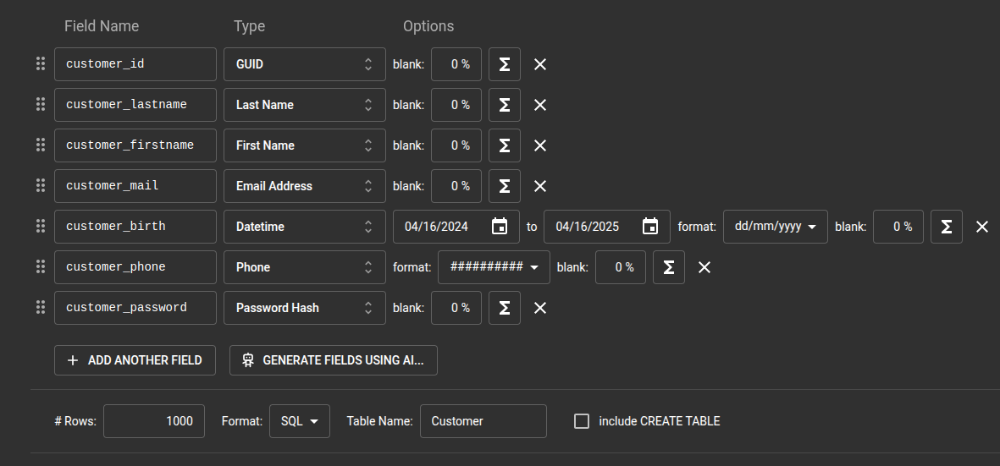

# Mockaroo

**Mockaroo** est un générateur de données fictives, il permet de générer des données pour une table précise en y inserant le nom des colonnes et leur valeurs.

## Générer un script SQL



On peut modifier le nombre de **Rows**, **format du fichier** et le **nom de la table**.

Un bouton **GENERATE DATA** nous permettra de télécharger les données générer aléatoirement.

## Insérer le script dans la base de données

Pour insérer le script dans la base de données il faut utiliser cette commande dans le terminal :

```bash
psql -U nom_utilisateur -d nom_bdd -f nom_fichier
```
